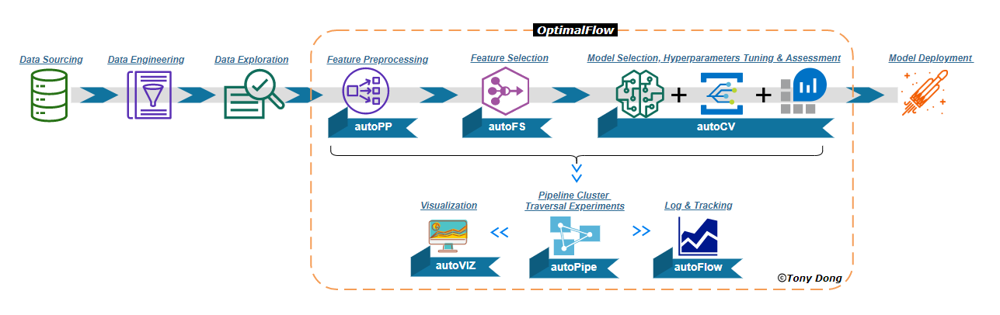

### What is Machine Learning?

[Expert AI](https://www.expert.ai/blog/machine-learning-definition/) defines `Machine learning` is an application of AI that enables systems to learn and improve from experience without being explicitly programmed. It is the science of using statistical algorithms to train a model with the capabilities of finding patterns from data.

It is the process of training computers, using math and statistical processes, to find and recognize patterns in data. After patterns are found, ML generates and updates training models to make increasingly accurate predictions and inferences about future outcomes based on historical and new data.

ML applications is an iterative process that involves a sequence of steps. To build an ML application, follow these general steps: 

Some applications of Machine Learning include:

* Google Translate
* Google Maps’ Traffic Prediction
* Recommendation Engine
* Spam Detection
* Self-driving Cars
* Speech recognition
* Medical diagnosis
* Statistical arbitrage
* Predictive analytics
* Image Recognition
* Extraction.

Machine learning can ingest limitless amounts of data, produce timely analysis and assessment, identify trends and patterns, and generate predictive forecasts.

### ML vs Rule-Based Systems

Classical programming uses data and static, hand-coded rules to generate results. Machine Learning uses historical data or output, combined with new data, to generate new rules in a training model.

### Types of Machine Learning

`Supervised learning` is a method where a model learns from a data set containing input values and paired output values that you would like to predict. Common supervised learning examples are Classification and Regression. For a supervised learning case, there are labels associated with features. The model is trained, and then it can make predictions on new features. In this way, the model is taught by certain features and targets.

`Feature matrix (X)`: made of observations (rows) and features (columns).

`Target variable (y)`: a vector with the target information we want to predict. For each row of `X` there's a value in `y`.

`Unsupervised learning` is a method in which the training model learns from data without any guidance. The objective is pattern and structure recognition. Common examples are
Clustering and Association.

`Reinforcement learning` is a method in which the training model learns from its environment by being rewarded for correct moves and punished for incorrect moves.

### CRISP-DM
`Cross-Industry Standard Process for Data Mining (CRISP-DM)` is a methodology for organizing ML projects. It was invented in the 90s by IBM. The steps of this procedure are:

Business understanding: An important question is if do we need ML for the project. The goal of the project has to be measurable.
Data understanding: Analyze available data sources, and decide if more data is required.
Data preparation: Clean data and remove noise applying pipelines, and the data should be converted to a tabular format, so we can put it into ML.
Modeling: training Different models and choose the best one. Considering the results of this step, it is proper to decide if is required to add new features or fix data issues.
Evaluation: Measure how well the model is performing and if it solves the business problem.
Deployment: Roll out to production to all the users. The evaluation and deployment often happen together - online evaluation.

For more on CRISP-DM, see [Smart Vision Europe article](https://www.sv-europe.com/crisp-dm-methodology/)

### ML Model Selection Process
Model selection is the process of choosing one of the models as the final model that addresses the problem.

The validation dataset is not used in training. There are feature matrices and y vectors for both training and validation datasets. The model is fitted with training data, and it is used to predict the y values of the validation feature matrix. Then, the predicted y values (probabilities) are compared with the actual y values.

Multiple comparisons problem (MCP): just by chance one model can be lucky and obtain good predictions because all of them are probabilistic.

The test set can help to avoid the MCP. Obtention of the best model is done with the training and validation datasets, while the test dataset is used for assuring that the proposed best model is the best.

* Split datasets in training, validation, and test
* Train the models
* Evaluate the models
* Select the best model
* Apply the best model to the test dataset
* Compare the performance metrics of validation and test

For more on model selection, see [Jason Brownlee Machine Learning Mastery article](https://machinelearningmastery.com/a-gentle-introduction-to-model-selection-for-machine-learning/).

### Python Programming Language
`Python` is a general-purpose, versatile, and powerful programming language. used commonly for web development, machine learning and Data science. It has become the number choice for implementing Data Science and Machine Learning. It is an open source software and widely used by the scientific community. It supports object-oriented programming and has thousands of packages designed by communities for solving many scientific and programmatic problems. 

Commonly used python packages for Data Science and Machine Learning include numpy, pandas, matplotlib, scipy, scikit-learn. A good place to read and learn about python is [Real Python](https://realpython.com/). The python software can be found here [Python Official Website](https://www.python.org/downloads/) or start with [Anaconda](https://www.anaconda.com/products/distribution).

#### Data Manipulation
`Numpy` and `Pandas` are python packages commonly used for reading and transforming data. They both support performing statistical analysis, cleaning, array manipulation and dataframe (tabular vizualization). For more on numpy, check out the [YouTube Numpy Link](https://www.youtube.com/watch?v=Qa0-jYtRdbY&list=PL3MmuxUbc_hIhxl5Ji8t4O6lPAOpHaCLR&index=8) and [YouTube Pandas Link](https://www.youtube.com/watch?v=0j3XK5PsnxA&list=PL3MmuxUbc_hIhxl5Ji8t4O6lPAOpHaCLR&index=10).

Pandas is a python library for data 
#### Visualization

