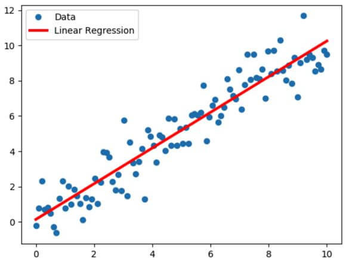

## Regression

Regression is a statistical method applied to two or more variables in order to understand the relationship between them. One variable is usually independent whereas the others are considered dependent.

Regression analysis is often used for prediction and forecasting.

### Terminologies used in Regression Analysis
#### Outliers 
Extreme or very low observation in a dataset compared to the other observations in the same data, i.e. it does not belong to the population.

#### Multicollinearity
When the independent variables are highly correlated to each other, then the variables are said to be multicollinear. Many types of regression techniques assume multicollinearity should not be present in the dataset. It is because it causes problems in ranking variables based on its importance, or it makes the job difficult in selecting the most important independent variable.

#### Heteroscedasticity
When the variation between the target variable and the independent variable is not constant, it is called heteroscedasticity. Example-As one’s income increases, the variability of food consumption will increase. A poorer person will spend a rather constant amount by always eating inexpensive food; a wealthier person may occasionally buy inexpensive food and at other times, eat expensive meals. Those with higher incomes display a greater variability of food consumption.

#### Underfit and Overfit
When we use unnecessary explanatory variables, it might lead to overfitting. Overfitting means that our algorithm works well on the training set but is unable to perform better on the test sets. It is also known as a problem of high variance.

[Great Learning](https://www.mygreatlearning.com/blog/what-is-regression/)

### Types of Regression
#### Linear Regression

The simplest of all regression types is Linear Regression which tries to establish relationships between Independent and Dependent variables. The Dependent variable considered here is always a continuous variable. Follows

$$Y = mx +c$$

What is Linear Regression?
Linear Regression is a predictive model used for finding the linear relationship between a dependent variable and one or more independent variables.

#### Polynomial Regression
This type of regression technique is used to model nonlinear equations by taking polynomial functions of independent variables.

#### Logistic Regression
Logistic Regression is also known as Logit, Maximum-Entropy classifier is a supervised learning method for classification. It establishes a relation between dependent class variables and independent variables using regression.

### Project plan:

Prepare data and Exploratory data analysis (EDA)
Use linear regression for predicting price
Understanding the internals of linear regression
Evaluating the model with RMSE
Feature engineering
Regularization
Using the model

**Pandas attributes and methods:** 

* pd.read_csv(<file_path_string>) - read csv files 
* df.head() - take a look of the dataframe 
* df.columns - retrieve colum names of a dataframe 
* df.columns.str.lower() - lowercase all the letters 
* df.columns.str.replace(' ', '_') - replace the space separator 
* df.dtypes - retrieve data types of all features 
* df.index - retrieve indices of a dataframe
